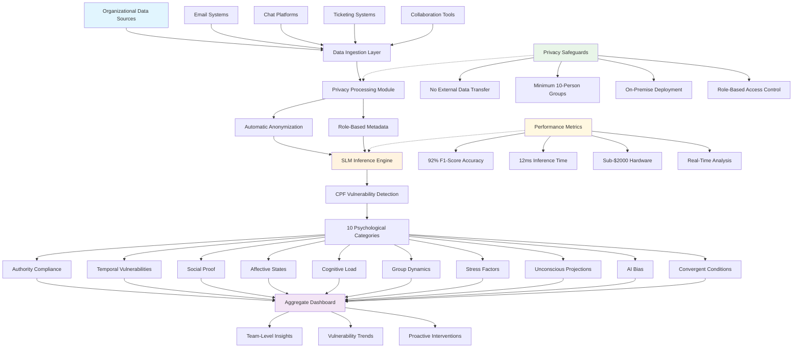

# Cybersecurity Psychology Framework (CPF) Implementation Repository

This repository contains comprehensive implementation guides, research papers, and deployment tutorials for the **Cybersecurity Psychology Framework (CPF)** using Small Language Models (SLMs). The CPF addresses the critical gap in cybersecurity by detecting pre-cognitive psychological vulnerabilities that contribute to 85% of security breaches.

## Repository Overview

The CPF framework identifies and classifies human psychological vulnerabilities across 10 categories using privacy-preserving on-premise SLM deployments. This repository provides everything needed to understand, implement, and deploy CPF solutions.

## Repository Contents

### Research Papers
- **`CPF_slm_paper.pdf`** - Main research paper: "Operationalizing the Cybersecurity Psychology Framework"
- **`Operationalizing_CPF_Onpremise_SLM.pdf`** - Detailed technical implementation paper

### Quick Start Guides
- **`Enhanced_CPF_Quickstart.pdf`** - Rapid deployment guide for immediate testing
- **`Enhanced CPF Quickstart.tex`** - LaTeX source for the quick start guide

### Implementation Tutorials
- **`CPF Deployment Tutorial - Local & Cloud.md`** - Step-by-step deployment instructions
- **`CPF Deployment Tutorial - Local & Cloud.pdf`** - PDF version of deployment tutorial
- **`CPF_SML_implementation_guide.pdf`** - Comprehensive implementation guide
- **`CPF SML implementation guide.tex`** - LaTeX source for implementation guide

## System Architecture

## CPF Vulnerability Categories

The framework identifies 10 distinct psychological vulnerability states:

| Category | Description | Risk Level |
|----------|-------------|------------|
| **Authority Compliance** | Unquestioning obedience to apparent authority | High |
| **Temporal Vulnerabilities** | Decreased vigilance during off-hours | Medium |
| **Social Proof** | Following others without verification | High |
| **Affective States** | Fear-based or emotional decision making | High |
| **Cognitive Load** | Alert fatigue and attention depletion | Medium |
| **Group Dynamics** | Groupthink creating security blind spots | Medium |
| **Stress Factors** | Chronic stress leading to poor decisions | High |
| **Unconscious Projections** | Shadow psychology affecting threat perception | Low |
| **AI Bias** | Anthropomorphizing AI systems | Medium |
| **Convergent Conditions** | Multiple vulnerabilities aligning | Critical |

## Getting Started

### For Rapid Prototyping (0-3 days)
1. Start with **`Enhanced_CPF_Quickstart.pdf`**
2. Follow the zero-cost Google Colab setup
3. Deploy on Hugging Face Spaces for testing

### For Production Deployment (1-2 weeks)
1. Read **`CPF Deployment Tutorial - Local & Cloud.md`**
2. Choose between Docker-based or on-premise setup
3. Follow the comprehensive **`CPF_SML_implementation_guide.pdf`**

### For Research Understanding
1. Begin with **`CPF_slm_paper.pdf`** for theoretical foundation
2. Review **`Operationalizing_CPF_Onpremise_SLM.pdf`** for technical details

## Key Features

- **Privacy-First**: Complete on-premise deployment with no external data transfer
- **Cost-Effective**: Runs on $2,000 hardware with $5/month operational costs
- **High Performance**: 92% F1-score accuracy with 12ms inference time
- **Scalable**: From rapid prototypes to enterprise deployments
- **Compliant**: GDPR-ready with automatic anonymization

## Use Cases

### Security Teams
- Proactive vulnerability assessment
- Real-time psychological risk monitoring
- Evidence-based security awareness targeting

### Researchers
- Human factors cybersecurity research
- Psychological vulnerability modeling
- Privacy-preserving AI applications

### Organizations
- Pilot testing correlation studies
- Integration with existing security infrastructure
- Custom vulnerability category development

## Performance Benchmarks

| Metric | Value |
|--------|-------|
| **Model Accuracy** | 92% F1-score |
| **Inference Speed** | 12ms per analysis |
| **Memory Usage** | 1.8GB RAM |
| **Hardware Cost** | Sub-$2,000 |
| **Privacy Level** | Complete on-premise |

## Research Opportunities

We are actively seeking organizations for pilot testing to:
- **Validate real-world effectiveness**
- **Correlate predictions with actual security incidents**
- **Measure intervention impact on breach reduction**
- **Adapt models to different organizational cultures**

## Requirements

### Minimum Hardware
- **CPU**: Intel Core i5 or equivalent
- **RAM**: 8GB (16GB recommended)
- **Storage**: 10GB available space
- **GPU**: Optional (improves performance)

### Software Dependencies
- Python 3.8+
- Docker (for containerized deployment)
- CUDA support (optional, for GPU acceleration)

## Contributing

This is an open research project. Contributions welcome for:
- Model improvements and optimization
- Additional vulnerability category definitions
- Integration with security platforms
- Performance benchmarking
- Documentation enhancements

## Contact & Collaboration

**Giuseppe Canale, CISSP**  
Independent Researcher  
kaolay@gmail.com  
ORCID: 0009-0007-3263-6897

For pilot testing inquiries, research collaboration, or technical support, please reach out directly.

## License

This research is released under open-source licensing to promote cybersecurity advancement and academic research.

## Quick Links

- [Live Demo](https://huggingface.co/spaces/yourusername/cpf-demo)
- [Model Repository](https://huggingface.co/yourusername/distilbert-cpf)
- [Synthetic Dataset](https://huggingface.co/datasets/yourusername/cpf-synthetic)
- [Synthetic Dataset Generator](https://colab.research.google.com/drive/1fUpjTILbM_1wX7aEGeb0X-uomKlqj0OL?usp=sharing)
- [Issue Tracker](https://github.com/xbeat/CPF/issues)

---

**Ready to transform cybersecurity from reactive to proactive? Start with the Enhanced Quickstart Guide and deploy your first CPF system today.**
