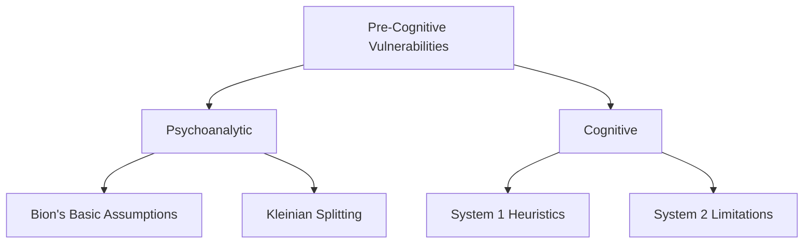

<p align="center">
  
</p>

# Cybersecurity Psychology Framework (CPF)

[](https://arxiv.org/abs/2510.09635)
[](https://doi.org/10.5281/zenodo.16795774)
[](https://doi.org/10.5281/zenodo.16944972)


[](https://papers.ssrn.com/abstract=5387222)
[](https://www.authorea.com/doi/full/10.22541/au.175704850.07776123/v1)


## Overview
**First psychoanalytic-cognitive model for pre-cognitive security vulnerabilities**

> "Technical defenses fail where psychology prevails" - 85% breaches involve human factors

## Key Features
- **100 indicators** across 10 vulnerability categories
- **Ternary scoring**: Green/Yellow/Red risk assessment
- **Attack vector mapping** to known exploit patterns
- **Privacy-preserving** aggregate analysis

## Community
Join our Discord server for discussions, collaboration, and pilot studies: CPF3 Community [https://discord.gg/xNRkTPeQ](https://discord.gg/xNRkTPeQ)

## Verification
```bash
# Verify document integrity:
openssl sha256 CPF_Preprint.pdf
# Compare with: dfb55fc21e1b204c342aa76145f1329fa6f095ceddc3aad8486dca91a580fa96
```

## Blockchain Verified
- **Bitcoin block 909232** attests existence as of 2025-08-09 CET

- ## Repository Structure

```bash
CPF (Public)/
│
├── auditor-field-kit/
│   └── [Auditor assessment tools and checklist]
│
├── languages/
│   └── [Multilingual resources and translations]
│
│── presentations/               # Main presentations folder
│   ├── authority-vulnerabilities/      # Category 1.x
│       └─── 1.2-diffusion-responsibility/  # Specific indicator
│            └─── slides.pdf
│
├── research/
│   └── [Foundational research materials]
│
├── vulnerabilities/
│   └── [Vulnerability taxonomy and documentation]
│
├── The_Cybersecurity_Psychology_Framework/
│   ├── (Taxonomy Complete).tex
│   ├── [Additional framework documents]
│   └── [Supporting materials]
│
├── cpf-maturity-model.md
├── cpf-white-paper.md
├── logo.svg
└── README.md
```
  
## Framework Matrix
| Category                          | Key Concept                | Example Vulnerability            |
|-----------------------------------|----------------------------|----------------------------------|
| Authority-Based (1.x)             | Milgram obedience          | CEO fraud susceptibility         |
| Temporal (2.x)                    | System 1 heuristic         | Urgency-induced security bypass  |
| Social Influence (3.x)            | Cialdini's principles      | Reciprocity exploitation         |
| Affective (4.x)                   | Klein-Bowlby affect theory | Fear-based decision paralysis    |
| Cognitive Overload (5.x)          | Miller's cognitive limits  | Alert fatigue desensitization    |
| Group Dynamic (6.x)               | Bion's basic assumptions   | Groupthink security blind spots  |
| Stress Response (7.x)             | Selye's stress theory      | Acute stress impairment          |
| Unconscious Process (8.x)         | Jungian shadow             | Shadow projection onto attackers |
| AI-Specific (9.x)                 | Anthropomorphism           | Over-trust in AI systems         |
| Critical Convergent States (10.x) | System theory              | Perfect storm conditions         |

## Core Components
- **Psychoanalytic Foundations**: Bion's Basic Assumptions, Kleinian Splitting
- **Cognitive Vulnerabilities**: System 1/System 2 risks, Cialdini's principles
- **AI-Specific**: Anthropomorphism, automation bias


## Framework Structure


## Academic Citation
```bibtex
@misc{canale2025cpf,
  title        = {Cybersecurity Psychology Framework},
  author       = {Canale, Giuseppe},
  year         = {2025}, 
  doi          = {10.5281/zenodo.16795774},
  url          = {https://github.com/xbaey/CPF},
  note         = {Preprint version 1.0}
}
```

## Contact Information
- **Author**: Giuseppe Canale, CISSP
- **Website**: [cpf3.org](https://cpf3.org)
- **Email**: [g.canale@escom.it](mailto:g.canale@escom.it)  
- **Academic Profile**: [ORCID 0009-0007-3263-6897](https://orcid.org/0009-0007-3263-6897)  
- **Professional Profile**: [LinkedIn](https://www.linkedin.com/in/giuseppe-canale)  
- **Repository Maintainer**: [@xbeat](https://github.com/xbeat)
